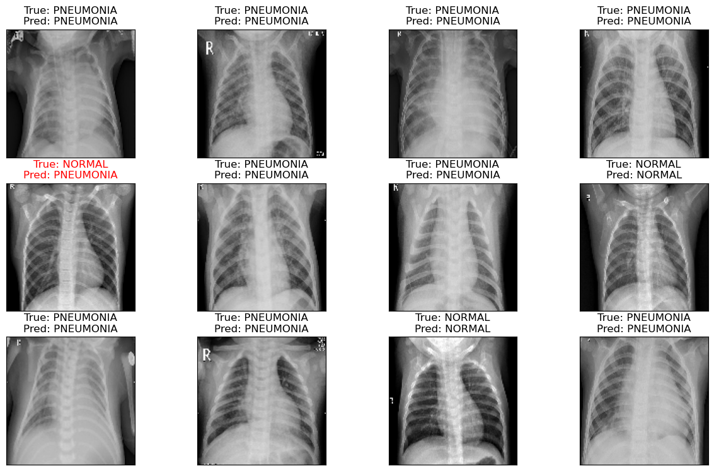

# Serving Inception-v3 Image Classification models with Triton Inference Server on Linux on IBM zSystems

Example to demonstrate serving Inception-v3 Image Classification models with Triton Inference Server on Linux on IBM zSystems.

## Getting started - Setup Environment

Install [Anaconda](https://docs.anaconda.com/anaconda/install/linux-s390x/) for Linux on zSystems.

On Ubuntu systems:

    apt install default-jdk libssl-dev

After installing these packages, follow the steps below:

    cd ONNX-MLIR-examples/image-classification-examples
    conda env create -f ./environment.yml
    conda activate image_classification

## Pneumonia Prediction - Use-case Details 

### Inception-v3
Inception v3 is an image recognition model that has been shown to attain greater than 78.1% accuracy on the ImageNet dataset.The Inception v3 architecture has been reused in many different image classification applications, and often used "pre-trained" from ImageNet. Here also we will be loading the pre-trained dataset, and fine tuning it with the Pneumonia prediciton dataset.

Reference - Introduced by Szegedy et al. in Rethinking the Inception Architecture for Computer Vision

## Download Dataset
[Chest X-Ray Images](https://www.kaggle.com/datasets/paultimothymooney/chest-xray-pneumonia)

## Train Inception-v3 Model

## Example 1 -- Deploying Inception-v3 model

In this examples, Inception-v3 model trained with tensorflow deployed on triton inference server using python backend.  

`Note:` Here, model repository is `ai-on-z-triton-is-examples/tree/main/image-classification-example/models/`

### A. Train Inception-v3 Pneumonia Prediction model

We first train a Incption-v3 model using the Pneumonia detection dataset. We save the model as a ONNX pipeline.

Follow `train.ipynb` to train the model. `evaluate.ipynb` for model evaluation. `onnx_conversion.ipynb` for ONNX conversion of the model

Finally model repository should look like below - 

    models
    ├── inception-v3
    │   ├── 1
    │   │   ├── inception-v3.onnx
    │   │   └── inception-v3.so
    │   └── config.pbtxt
    └── cnn
        ├── 1
        │   ├── cnn.onnx
        │   └── cnn.so
        └── config.pbtxt

### B. Start triton server with model repository

    docker run --shm-size=1g --ulimit memlock=-1  --ulimit stack=67108864 --rm -p8000:8000 -p8001:8001 -p8002:8002 -v//<path>/models:/models <imageid> tritonserver --model-repository=/models

### C. Test the inception-v3 model deployed in triton server

    python test_service.py --model inception-v3

