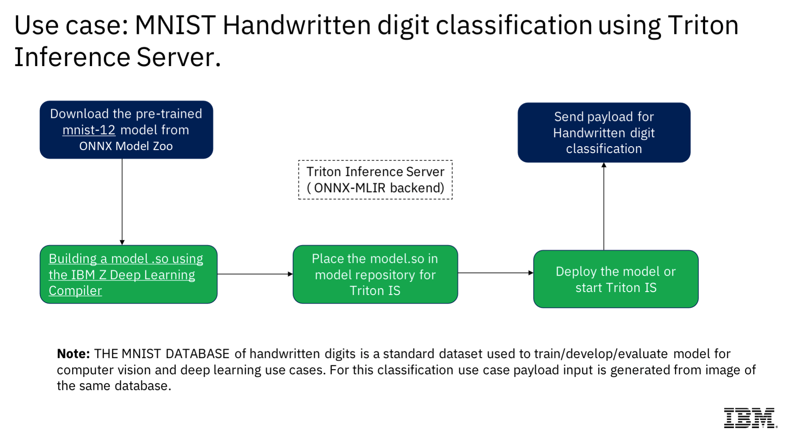

# Triton Inference Server with zDLC and Python Preprocessing
This example solves the MNIST Handwritten digit classification problem by using the zDLC and Triton Inference Server with an ensemble preprocessing approach.



## Step 1 - Build a model.so using IBM Z Deep Learning Complier
- Follow [zDLC documentation](https://github.com/IBM/zDLC)

## Step 2 - Build the Triton Inference Server
- Build docker image
    ```
    docker build -t tis-py .
    ```

## Step 3 - Start the Triton Inference Server
- Run docker container
    ```
    docker run --shm-size 1G -u root --rm -p8000:8000 -v//$PWD/ensemble-pipeline/models:/models tis-py tritonserver --model-repository=/models
    ```

## Step 4 - Model Inferencing using the Triton Inference Server

### Option 1: Use sample python script
- Run python script from terminal with ip/port of triton inference server
    ```
    python test-inferencing/inference_request.py <ip:port>
    ```

### Option 2: Use JMeter
#### Obtain & Install
1. Verify Java Installation
    ```
    java -version
    ```
2. Set Java Environment
    ```
    export JAVA_HOME=/path/to/java
    ```
3. Update PATH to include JAVA_HOME
    ```
    export PATH=$PATH:$JAVA_HOME/bin/
    ```
3. [Download JMeter from official website](https://jmeter.apache.org/download_jmeter.cgi)

#### Usage Guidance
- Review [helpful quick guide overview](https://www.tutorialspoint.com/jmeter/jmeter_quick_guide.htm) for more details on how to install and run JMeter
- Open sample [test plan](https://github.ibm.com/AIonZ/triton-zDLC-py-preprocess/blob/main/test-inferencing/Triton_zDLC_Test.jmx) in JMeter
- Run test plan in JMeter

### Option 3: Use GHZ
#### Obtain & Install
1. Install Go (prerequisite)
    ```
    yum install golang
    ```
2. Clone ghz code
    ```
    git clone https://github.com/bojand/ghz
    ```
3. Build using make
    ```
    make build
    ```

#### Usage Guidance
1. Run ghz in terminal
    ```
    ghz
    ```

#### Example with ghz
1. Run ghz in terminal (example below with ip 0.0.0.0)
    ```
    ghz --insecure --proto ./test-inferencing/grpc/grpc_service.proto --call inference.GRPCInferenceService.ModelInfer -B ./test-inferencing/grpc/triton-requests-zdlc.pb 0.0.0.0:8001
    ```